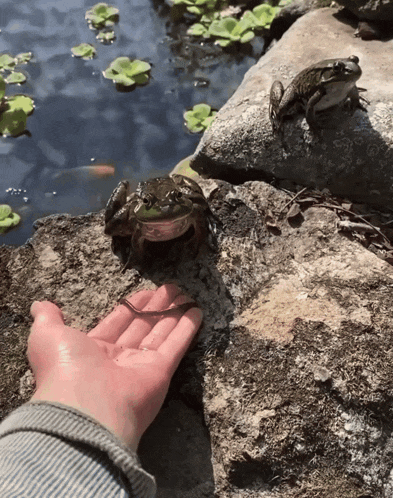

<div align="center">

# 🐸 Bioacoustics Audio Classification


**End-to-end bioacoustic monitoring pipeline — from PyTorch model training to TFLite deployment on Arduino Nano 33 BLE Sense**




</div>

---

## 🌿 Project Overview

Frogs are highly sensitive ecological indicators — their calls reveal the health of wetlands, paddy fields, and forest ecosystems in ways that other sensors cannot. Yet continuous, large-scale acoustic monitoring has traditionally required trained field biologists and expensive equipment.

This project automates the full workflow end-to-end:

1. **Training (PyTorch)** — A CNN-based classifier is trained on Indian frog recordings. Audio is segmented, features are extracted (mel-spectrograms via `librosa`). The model achieves **97.44% test accuracy**.

2. **Conversion** — PyTorch models (.pth) are converted through a robust pipeline: **PyTorch → ONNX → TensorFlow → TFLite (int8 quantization)** for edge deployment.

3. **Deployment (Arduino)** — The quantized model is packaged via Edge Impulse into an Arduino inference library and flashed onto an **Arduino Nano 33 BLE Sense**, which classifies frog calls in real time on-device — no cloud, no internet, no external compute.

The result is a palm-sized, battery-powered acoustic sensor you can zip-tie to a tree.

### Problems This Solves

| Challenge | Solution |
|-----------|----------|
| Expert-dependent manual surveys | Deep Learning based classification |
| Cloud inference needs connectivity | TFLite on-device inference via Edge Impulse |
| PyTorch models can't run on MCUs | PyTorch → ONNX → TF → TFLite conversion pipeline |
| Long recordings are hard to label | Segmentation pipeline (`pydub`) |
| Noisy and variable field conditions | Data augmentation during training |
| Single-sensor failure modes | Multi-sensor fusion sketch (mic + IMU + environment) |
| Continuous unattended monitoring | Streaming continuous inference sketch |

---

## 🧠 Model Comparison

Two approaches were implemented and evaluated:

| Feature | **Custom CNN (Primary)** | **EfficientNet-B0 (Transfer Learning)** |
|:--------|:------------------------:|:----------------------------------------:|
| Framework | PyTorch | PyTorch |
| Approach | Built from scratch | Pretrained on ImageNet |
| **Test Accuracy** | **97.44%** | 70.00% |
| Training Time | Fast (~10 min) | Moderate (~30 min) |
| Model Size (FP32) | ~10 MB | ~20 MB |
| TFLite Size (int8) | ~2.5 MB | ~5 MB |
| Data Augmentation | ❌ | ✅ |
| Overfitting | Slight | Minimal |
| Inference Speed (MCU) | **~9 ms** | ~15 ms |
| **Recommendation** | ✅ **Primary model** | For larger datasets |

### Per-Class Performance Breakdown

**Custom CNN (97.44% overall):**
| Species | Accuracy |
|---------|----------|
| *Duttaphrynus melanostictus* | 96.43% |
| *Euphlyctis cyanophlyctis* | 95.83% |
| *Hoplobatrachus tigerinus* | 100.00% |
| *Microhyla ornata* | 97.50% |

**Transfer Learning (70.00% overall):**
| Species | Accuracy |
|---------|----------|
| *Duttaphrynus melanostictus* | 57.14% |
| *Euphlyctis cyanophlyctis* | 66.67% |
| *Hoplobatrachus tigerinus* | 100.00% |
| *Microhyla ornata* | 60.00% |

> **Conclusion:** The custom CNN significantly outperforms transfer learning for this specific 4-species classification task with the available dataset size.

---
## 🏗️ System Architecture
```

╔══════════════════════════════════════════════════════════════════════════════╗
║ TRAINING PIPELINE (PyTorch)                                                  ║
║                                                                              ║
║ _dataset/ (raw .wav recordings, by species)                                  ║
║      │                                                                       ║
║      ▼                                                                       ║
║ ┌──────────────────┐                                                         ║
║ │   Segmentation   │ pydub — split long clips into 5-sec windows             ║
║ └────────┬─────────┘                                                         ║
║          │                                                                   ║
║          ▼                                                                   ║
║ ┌──────────────────┐                                                         ║
║ │ Feature Extract  │ librosa — Mel Spectrogram (128 bands)                  ║
║ └────────┬─────────┘                                                         ║
║          │                                                                   ║
║          ▼                                                                   ║
║ ┌──────────────────┐                                                         ║
║ │   CNN Training   │ PyTorch Custom CNN (4 Conv Blocks + FC)                 ║
║ └────────┬─────────┘                                                         ║
║          │                                                                   ║
║          ▼                                                                   ║
║ ┌──────────────────┐                                                         ║
║ │   Model Export   │ best_audio_classifier.pth (PyTorch weights)             ║
║ └────────┬─────────┘                                                         ║
╚══════════╪═══════════════════════════════════════════════════════════════════╝
           │
           ▼
╔══════════════════════════════════════════════════════════════════════════════╗
║ MODEL CONVERSION PIPELINE                                                    ║
║                                                                              ║
║ ┌──────────┐   ┌──────────┐   ┌──────────────┐   ┌──────────┐   ┌──────────┐ ║
║ │ PyTorch  │──▶│   ONNX   │──▶│  TensorFlow  │──▶│  TFLite  │──▶│   Edge   │ ║
║ │ .pth/.pt │   │   Model  │   │  SavedModel  │   │  (int8)  │   │ Impulse  │ ║
║ └──────────┘   └──────────┘   └──────────────┘   └────┬─────┘   └────┬─────┘ ║
║                                                       │              │       ║
║                                               int8 quantization   Arduino    ║
║                                                 (4x smaller)    Library.zip  ║
╚═══════════════════════════════════════════════════════╪══════════════╪═══════╝
                                                        │
                                                        ▼
╔══════════════════════════════════════════════════════════════════════════════╗
║ EDGE DEPLOYMENT                                                              ║
║ Arduino Nano 33 BLE Sense · nRF52840                                         ║
║                                                                              ║
║ ┌──────────────────────────────────────────────────────────────────────────┐ ║
║ │ nano_ble33_sense_microphone.ino                                          │ ║
║ │ Single audio window → DSP features → inference → Serial                  │ ║
║ └──────────────────────────────────────────────────────────────────────────┘ ║
║ ┌──────────────────────────────────────────────────────────────────────────┐ ║
║ │ nano_ble33_sense_microphone_continuous.ino                               │ ║
║ │ Continuous PDM stream → sliding window → rolling inference                │ ║
║ └──────────────────────────────────────────────────────────────────────────┘ ║
║ ┌──────────────────────────────────────────────────────────────────────────┐ ║
║ │ nano_ble33_sense_camera.ino                                              │ ║
║ │ OV7675 image frame → visual species identification                       │ ║
║ └──────────────────────────────────────────────────────────────────────────┘ ║
║ ┌──────────────────────────────────────────────────────────────────────────┐ ║
║ │ nano_ble33_sense_fusion.ino                                              │ ║
║ │ Mic + IMU + temp/humidity → fused multi-sensor inference                 │ ║
║ └──────────────────────────────────────────────────────────────────────────┘ ║
║                                      │                                       ║
║                                      ▼                                       ║
║                        Serial Monitor @ 115200 baud                          ║
║              Species label · Confidence score · Timing                       ║
╚══════════════════════════════════════════════════════════════════════════════╝
```

---

## 🔧 Hardware Requirements

### Arduino Nano 33 BLE Sense *(required)*

| Component | Specification |
|-----------|---------------|
| MCU | Nordic nRF52840 — ARM Cortex-M4F @ 64 MHz |
| RAM | 256 KB SRAM |
| Flash | 1 MB |
| **Onboard mic** | **MP34DT05 PDM digital microphone** ← required for all audio sketches |
| IMU | LSM9DS1 — 9-axis (accel / gyro / magnetometer) |
| Environment | HTS221 (temp + humidity) · LPS22HB (pressure) |
| Gesture / light | APDS-9960 |
| Wireless | Bluetooth 5.0 BLE |
| Interface | Native USB — programming + Serial Monitor |

## 💻 Software & Dependencies

This project uses **[`uv`](https://github.com/astral-sh/uv)** as its package manager — fast, modern, and reproducible. Python **3.9** is pinned.

### PyTorch + CUDA Installation

```bash
# For NVIDIA GPU (CUDA 11.8) - Recommended
pip install torch torchvision torchaudio --index-url https://download.pytorch.org/whl/cu118

# For CUDA 12.1 (newer GPUs like RTX 40 series)
pip install torch torchvision torchaudio --index-url https://download.pytorch.org/whl/cu121

# CPU-only (if no GPU available)
pip install torch torchvision torchaudio
```
```
# Audio processing & ML
pip install librosa matplotlib seaborn scikit-learn sounddevice flask
pip install numpy scipy tqdm

# Model conversion (PyTorch → TFLite)
pip install onnx onnx2tf tensorflow==2.20.0

# Data augmentation & audio segmentation
pip install audiomentations pydub
```
```
import torch
print(f"PyTorch: {torch.__version__}")
print(f"CUDA Available: {torch.cuda.is_available()}")
print(f"GPU Device: {torch.cuda.get_device_name(0) if torch.cuda.is_available() else 'CPU'}")

```
----
## Dataset
```
dataset/
├── Duttaphrynus_melanostictus/
│   ├── rec_001.wav
│   ├── rec_002.wav
│   └── ...
├── Euphlyctis_cyanophlyctis/
│   ├── rec_001.wav
│   └── ...
├── Hoplobatrachus_tigerinus/
│   ├── rec_001.wav
│   └── ...
└── Microhyla_ornata/
    ├── rec_001.wav
    └── ...
```

## 🎧 Audio Processing Configuration

| Parameter    | Value      | Description                     |
|--------------|------------|---------------------------------|
| Sample Rate  | 22,050 Hz  | Target sampling frequency       |
| Duration     | 5 seconds  | Fixed audio clip length         |
| N_MELS       | 128        | Number of mel bands             |
| N_FFT        | 2048       | FFT window size                 |
| Hop Length   | 512        | Stride between windows          |

---

## 🛠 Feature Extraction Pipeline

The raw audio is transformed into a **log-scale Mel Spectrogram** to be used as a 2D image-like input for the Convolutional Neural Network.

```
Audio clip (22.05 kHz · mono · .wav)
        │
        ▼
Mel Spectrogram (librosa)
├── n_mels = 128
├── hop_length = 512
├── n_fft = 2048
└── power_to_db (log scale)
        │
        ▼
2-D feature map (128 × 216)
        │
        ▼
CNN Input (1 × 128 × 216)
```
---
## 🔊 Data Augmentation (audiomentations)

To ensure the model is robust against real-world field conditions, the following transforms are applied during training:

AddGaussianNoise: Simulates environmental background noise and wind
TimeStretch: Handles speed variations without affecting pitch
PitchShift: Models natural call variations across different individual frogs
Shift: Introduces random temporal offsets within the 5-second window
Gain: Simulates varying recording distances and microphone sensitivities

---
## 🚀 Training Pipeline
Model 1: Custom CNN (Recommended)

This lightweight architecture is designed specifically for spectrogram pattern recognition.

Architecture Details
```
Input: (1, 128, 216) Mel-Spectrogram
    ↓
Conv2D(1→32, 3×3) + BatchNorm + ReLU + MaxPool(2×2)
    ↓
Conv2D(32→64, 3×3) + BatchNorm + ReLU + MaxPool(2×2)
    ↓
Conv2D(64→128, 3×3) + BatchNorm + ReLU + MaxPool(2×2)
    ↓
Conv2D(128→256, 3×3) + BatchNorm + ReLU + AdaptiveAvgPool(4×4)
    ↓
Flatten (4096) → Dropout(0.5)
    ↓
Linear(512) → ReLU → Dropout(0.3)
    ↓
Linear(256) → ReLU
    ↓
Linear(4) → Softmax (4 species)
```
```
python Training/model-1-cnn/model_1_cnn.py
```
## Model 2: Transfer Learning (EfficientNet-B0)

Utilizes a pre-trained EfficientNet backbone fine-tuned for audio classification tasks.
```
python Training/model-2-transfer/model_2_transfer.py
```
----
## 🔄 PyTorch to TFLite Conversion

This is the critical pipeline for moving models from high-level frameworks to microcontrollers.

---

### Step 1: Export PyTorch to ONNX

```
import torch
from model_1_cnn import AudioCNN

# Load your trained PyTorch model
model = AudioCNN(num_classes=4)
model.load_state_dict(torch.load('best_audio_classifier.pth', map_location='cpu'))
model.eval()

# Create dummy input matching your model's expected input shape
# Shape: (batch_size, channels, height, width) = (1, 1, 128, 216)
dummy_input = torch.randn(1, 1, 128, 216)

# Export to ONNX
torch.onnx.export(
    model, 
    dummy_input, 
    "frog_classifier.onnx",
    input_names=['input'],
    output_names=['output'],
    dynamic_axes={
        'input': {0: 'batch_size'},
        'output': {0: 'batch_size'}
    },
    opset_version=11
)

print("✅ ONNX export complete: frog_classifier.onnx")
```

### Step 2: ONNX to TensorFlow SavedModel

```bash id="v1c7mz"
# Install onnx2tf if not already installed
pip install onnx2tf

# Convert ONNX to TensorFlow SavedModel
onnx2tf -i frog_classifier.onnx -o tf_saved_model

# Expected output:
# ✅ SavedModel exported to: tf_saved_model/
```

## Step 3: TensorFlow to TFLite with int8 Quantization
```
import tensorflow as tf
import numpy as np

# Representative dataset for quantization calibration
def representative_dataset():
    """Generate representative samples for int8 quantization calibration."""
    # Load some sample spectrograms from your validation set
    # This example uses random data - replace with actual validation samples
    for _ in range(100):
        # Shape: (1, 128, 216, 1) - note the channel dimension change for TF
        sample = np.random.rand(1, 128, 216, 1).astype(np.float32)
        yield [sample]

# Load the SavedModel
converter = tf.lite.TFLiteConverter.from_saved_model('tf_saved_model')

# Apply int8 quantization
converter.optimizations = [tf.lite.Optimize.DEFAULT]
converter.representative_dataset = representative_dataset
converter.target_spec.supported_ops = [tf.lite.OpsSet.TFLITE_BUILTINS_INT8]
converter.inference_input_type = tf.int8
converter.inference_output_type = tf.int8

# Convert the model
tflite_quant_model = converter.convert()

# Save the quantized TFLite model
with open('frog_classifier_int8.tflite', 'wb') as f:
    f.write(tflite_quant_model)

print("✅ TFLite int8 quantization complete: frog_classifier_int8.tflite")

# Check file size
import os
size_mb = os.path.getsize('frog_classifier_int8.tflite') / (1024 * 1024)
print(f"📦 Model size: {size_mb:.2f} MB")
```
## 🔄 Conversion Pipeline Summary

| Step | Format            | Tool              | Output                     |
|------|------------------|-------------------|----------------------------|
| 1    | PyTorch (.pth)   | torch.onnx        | ONNX (.onnx)               |
| 2    | ONNX (.onnx)     | onnx2tf           | TF SavedModel              |
| 3    | TF SavedModel    | TFLite Converter  | TFLite int8 (.tflite)      |
| 4    | TFLite (.tflite) | Edge Impulse      | Arduino Library (.zip)     |

---

### 📦 Size Reduction

**FP32 (~10 MB) → int8 (~2.5 MB) = ~4× smaller**

## 🚀 Running Inference

### 🔹 1. Single Audio File
```bash
python classify_audio.py --file path/to/audio.wav
```
✔ Outputs:
Predicted frog species
Confidence score
Class probability distribution

### 🔹 2. Batch Processing (Folder)
```
python classify_audio.py --folder path/to/audio_folder/
```
✔ Outputs:
Predictions for all files
Summary of species distribution

###🔹 3. Live Microphone Inference
```
python classify_audio.py --live --duration 3
```
Records audio from microphone
Classifies every 3 seconds
Displays prediction + probability bars

###🔹 4. Real-Time Streaming Demo
```
python realtime_demo.py
```

💡 How it works:
Continuously listens to microphone input
Processes audio in chunks (3 seconds)
Prints predictions in real-time

Example output:

Listening for frog calls...
==================================================
Prediction: Hoplobatrachus_tigerinus (92.34%)

##  🌐 API Server (FLASK)
```bash
python predict.py
```
```
Output :
{
  "species": "Hoplobatrachus_tigerinus",
  "confidence": 0.92
}
```


